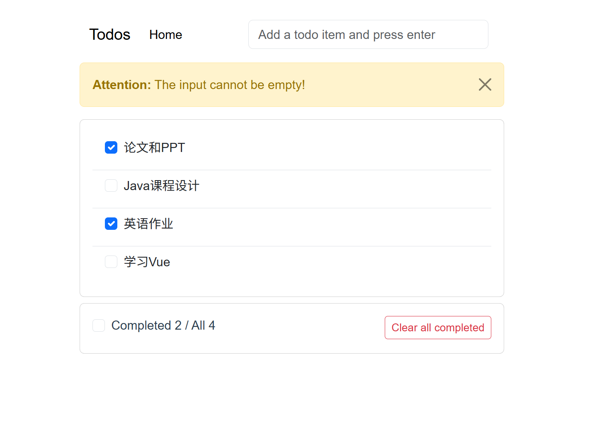

<div align="center">
  
  
  
</div>

<br/>

<div align="center">
  <h1>📋 Todo 待办事项应用</h1>
  <p>基于 <strong>Vue 2</strong> + <strong>Bootstrap 5</strong> 构建的简洁优雅的待办事项应用</p>
</div>

---

## ✨ 功能特性

- **➕ 添加待办** — 按下 Enter 键快速添加新任务
- **✅ 切换完成状态** — 点击复选框标记任务完成/未完成
- **🗑️ 删除待办** — 点击删除按钮移除单个任务
- **🔘 全选/取消全选** — 一键勾选或取消所有任务
- **🧹 清除已完成** — 一键删除所有已完成的任务
- **📦 本地存储** — 数据自动保存到浏览器 LocalStorage，刷新不丢失
- **⚠️ 输入验证** — 输入为空时弹出警告提示
- **💨 响应式设计** — 基于 Bootstrap 5，适配各种屏幕

## 🖥️ 运行截图



## 🚀 快速开始

### 环境要求

- [Node.js](https://nodejs.org/) (v12 或以上)
- npm 或 yarn

### 安装与运行

```bash
# 克隆仓库
git clone https://github.com/<你的用户名>/<仓库名>.git

# 进入项目目录
cd my_vue_project

# 安装依赖
npm install

# 启动开发服务器
npm run serve
```

打开浏览器访问 `http://localhost:8080`，修改代码后页面会自动热更新。

### 生产构建

```bash
npm run build
```

构建产物在 `dist/` 目录中，可直接部署。

### 代码检查

```bash
npm run lint
```

## 🏗️ 项目结构

```
my_vue_project/
├── public/
│   ├── favicon.ico
│   └── index.html
├── src/
│   ├── assets/
│   │   └── logo.png
│   ├── components/
│   │   ├── VueHeader.vue      # 导航栏 + 输入框
│   │   ├── VueList.vue        # 待办列表容器
│   │   ├── VueItem.vue        # 单个待办项
│   │   ├── VueFooter.vue      # 统计信息与批量操作
│   │   └── VueAlerts.vue      # 警告提示组件
│   ├── App.vue                # 根组件
│   └── main.js                # 入口文件
├── babel.config.js
├── jsconfig.json
├── vue.config.js
├── package.json
└── README.md
```

## 🧩 组件树

```
App.vue
├── VueHeader        — 输入栏（按 Enter 添加）
├── VueAlerts        — 空输入警告（条件渲染）
├── VueList          — 待办列表（有数据时显示）
│   └── VueItem      — 单个待办项（复选框、文本、删除按钮）
└── VueFooter        — 统计与批量操作（有数据时显示）
```

## 🔄 数据流

| Prop | 来源 → 目标 | 作用 |
|------|------------|------|
| `receive` | App → VueHeader | 回调：添加新待办 |
| `hideAlerts` | App → VueAlerts | 回调：关闭警告 |
| `todos` | App → VueList / VueFooter | 待办数据（子组件只读） |
| `checkTodo` | App → VueList → VueItem | 回调：切换完成状态 |
| `removeTodo` | App → VueList → VueItem | 回调：删除待办 |
| `selectAll` | App → VueFooter | 回调：全选/取消全选 |
| `clearCompleted` | App → VueFooter | 回调：清除已完成 |

## 🛠️ 技术栈

- **[Vue 2](https://v2.vuejs.org/)** — 渐进式 JavaScript 框架
- **[Bootstrap 5](https://getbootstrap.com/)** — 响应式 CSS 框架
- **[nanoid](https://github.com/ai/nanoid)** — 唯一 ID 生成
- **[Vue CLI](https://cli.vuejs.org/)** — 项目脚手架与构建工具

## 📄 许可证

本项目基于 [MIT License](LICENSE) 开源。
